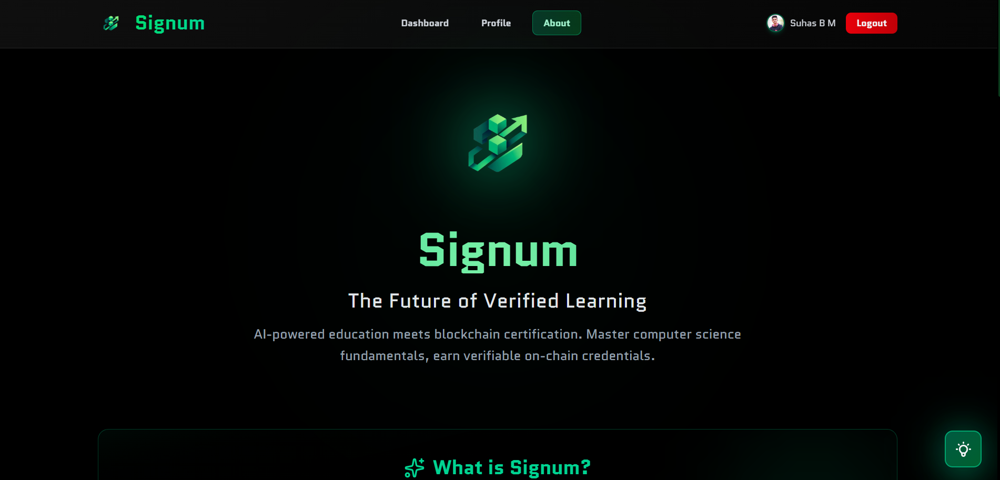
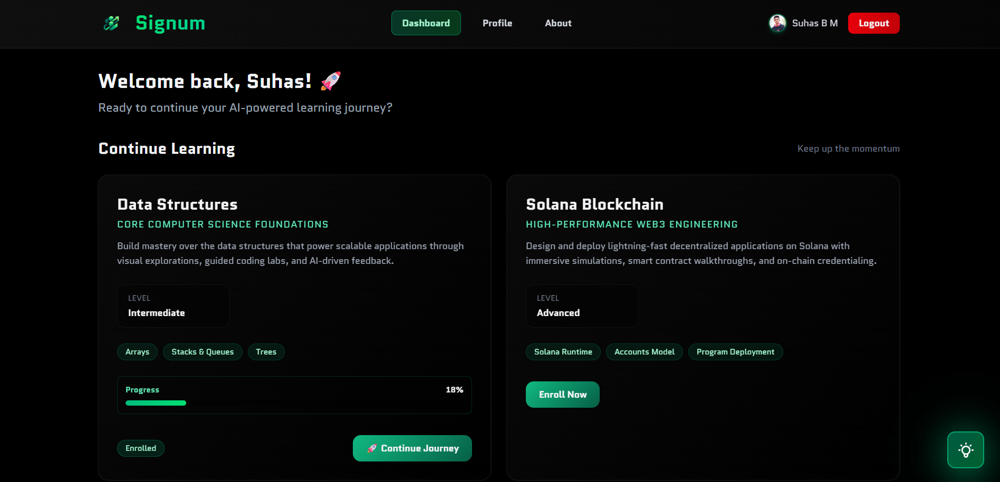
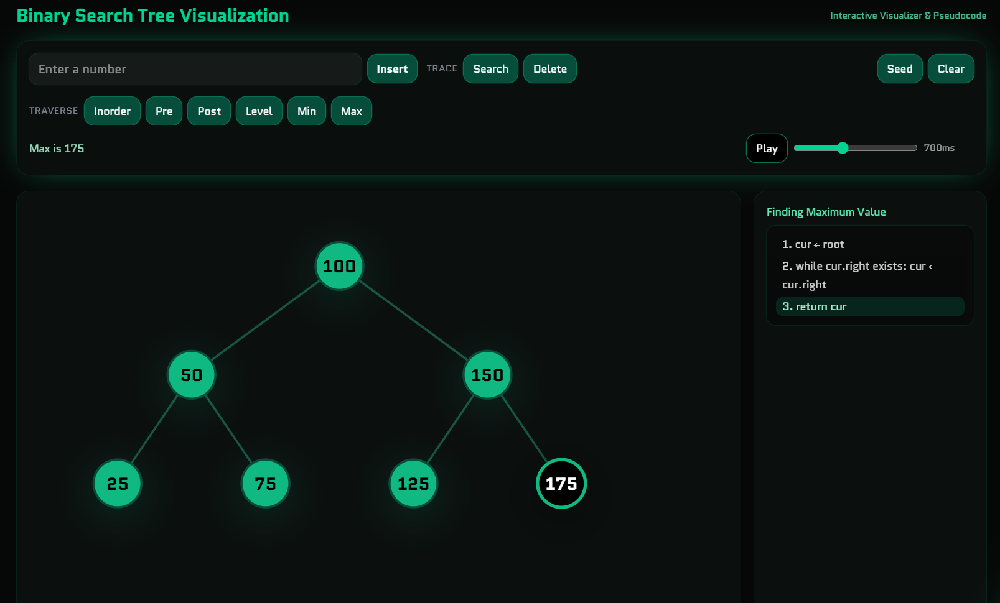
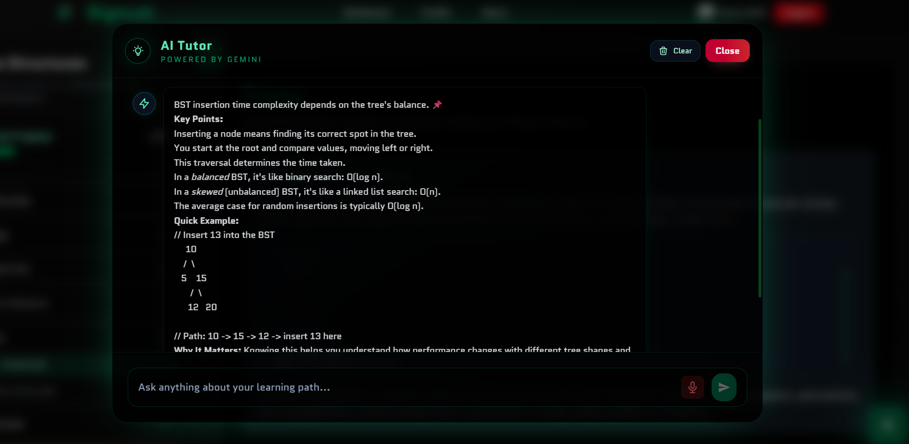
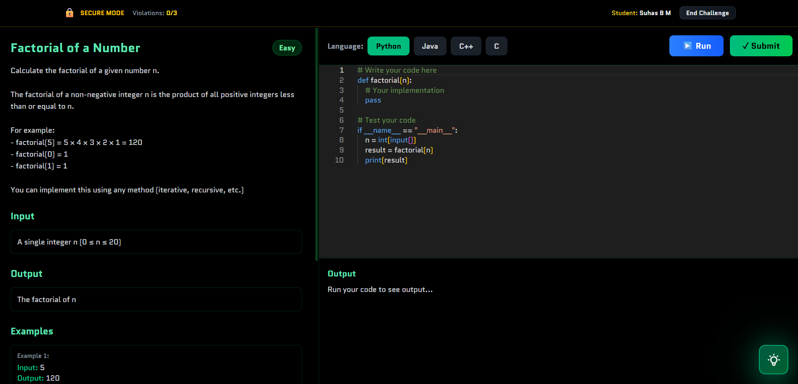
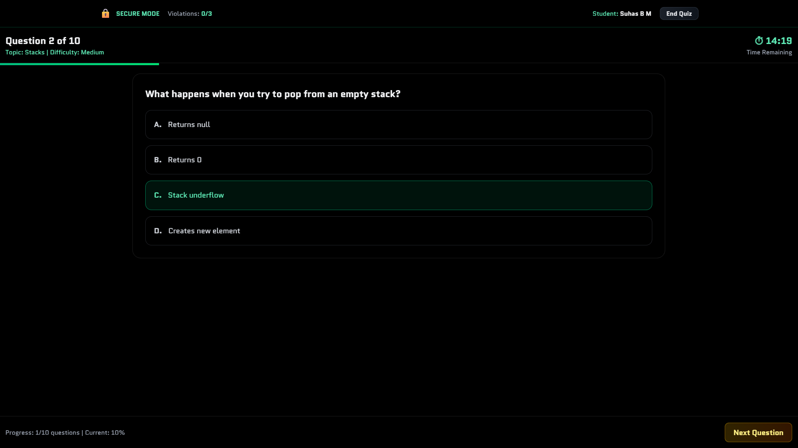
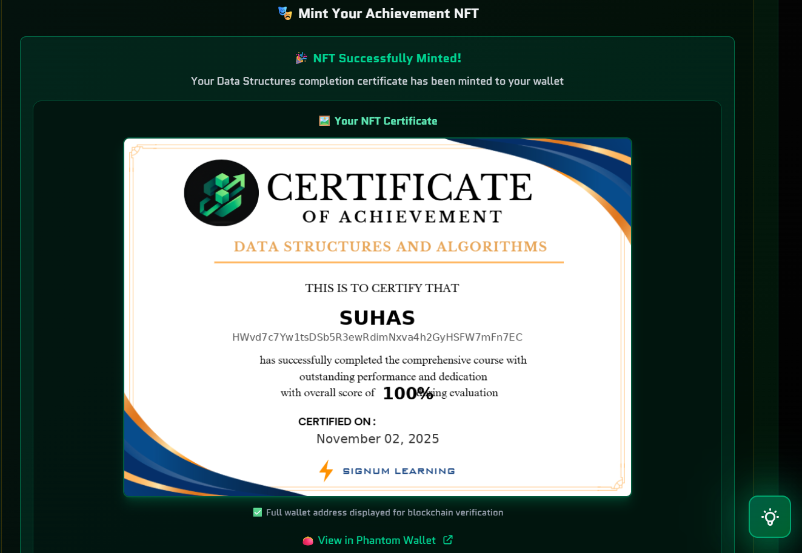
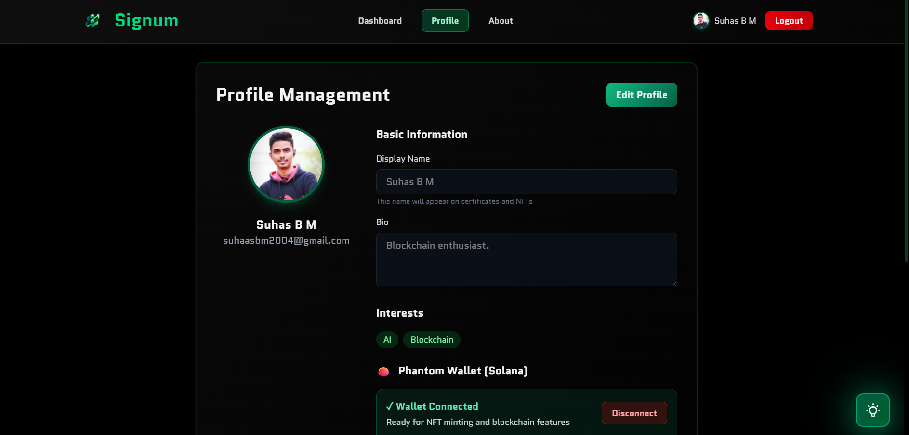
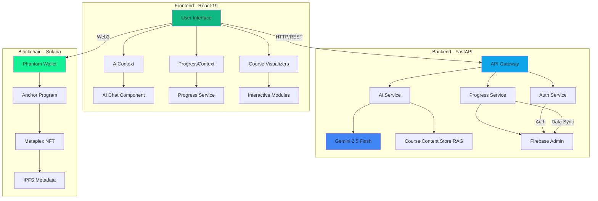

<div align="center">

# Signum

### AI-Powered Learning Platform with Blockchain Credentials

*Unforgettable Learning. Unforgeable Credentials.*

[](https://react.dev/)
[](https://fastapi.tiangolo.com/)
[](https://solana.com/)
[](https://ai.google.dev/)
[](LICENSE)

[Features](#-core-features) • [Demo](#-screenshots) • [Quick Start](#-quick-start) • [Documentation](#-documentation) • [Tech Stack](#-tech-stack)

</div>

---

## 🎯 Overview

**Signum** is a next-generation e-learning platform that revolutionizes computer science education by combining three cutting-edge technologies:

- **🤖 AI-Powered Tutoring** - Context-aware assistant using Google Gemini 2.5 Flash with RAG (Retrieval-Augmented Generation)
- **🛡️ Anti-Cheat Protection** - Real-time monitoring system ensuring academic integrity with 3-strike policy
- **🔗 Blockchain Certificates** - Verifiable NFT credentials minted on Solana blockchain

Built for students who demand **interactive learning experiences** and employers who need **trustless credential verification**.

---

## ✨ Core Features

<table>
<tr>
<td width="50%">

### 🎨 Interactive Visualizations
**Learn by Doing**

- **5 Live Data Structure Visualizers**
  - Binary Search Trees with traversal animations
  - Stack push/pop operations with step tracking
  - Queue enqueue/dequeue demonstrations
  - 2D Array matrix manipulations
  - 1D Array search & sort algorithms
- **Real-Time Pseudocode Sync** - Watch code execute line-by-line
- **Interactive Controls** - Insert, delete, search with visual feedback
- **Algorithm Demonstrations** - Min/max, traversal, search operations

</td>
<td width="50%">

### 🤖 AI Learning Assistant
**Your 24/7 Tutor**

- **Context-Aware Intelligence** - Knows what's on your screen
- **Voice Input Support** - Speak naturally, get structured answers
- **RAG-Powered Responses** - Retrieves course-specific knowledge
- **Multi-Modal Communication** - Text, code snippets, step-by-step explanations
- **Conversation Memory** - Maintains context across your learning session
- **Google Gemini 2.5 Flash** - Latest AI model for instant, accurate help

</td>
</tr>
<tr>
<td width="50%">

### 🛡️ Anti-Cheat System
**Integrity First**

- **5 Detection Methods**
  - Tab/window switching monitoring
  - Copy/paste blocking
  - DevTools detection
  - Right-click prevention
  - Keyboard shortcut blocking
- **3-Strike Policy** - Progressive violation tracking
- **Firebase-Backed** - Persistent violation logs
- **NFT Eligibility** - Clean record required for certification
- **Fullscreen Enforcement** - Auto-submission on exit

</td>
<td width="50%">

### 🔗 Blockchain Certificates
**Verifiable Forever**

- **Solana Blockchain** - Fast, low-cost, decentralized
- **Metaplex Standard** - Compatible with all NFT marketplaces
- **Phantom Wallet** - Seamless Web3 integration
- **Dynamic Certificate Images** - Personalized with your data
- **IPFS Metadata** - Decentralized storage via Pinata
- **Social Sharing** - LinkedIn & X (Twitter) ready
- **Trustless Verification** - Anyone can verify on Solana Explorer

</td>
</tr>
<tr>
<td width="50%">

### 💻 Coding Challenges
**Test Real Skills**

- **AI-Powered Evaluation** - Gemini analyzes code quality
- **Test Case Validation** - Automated correctness checking
- **Real-Time Feedback** - Instant suggestions for improvement
- **Monaco Editor** - VS Code experience in browser
- **Anti-Cheat Protected** - Same monitoring as quizzes
- **50% Weight** - Combines with quiz for final score

</td>
<td width="50%">

### 📊 Progress Tracking
**Know Your Growth**

- **Firebase Realtime Sync** - Never lose your progress
- **Multi-Metric Dashboard** - Quiz, coding, completion, violations
- **Visual Progress Bars** - See completion at a glance
- **Time-Based Validation** - 20-90s minimum per module
- **Course Completion Logic**
  - Quiz Score ≥ 85%
  - Course Completion ≥ 90%
  - Zero Anti-Cheat Violations

</td>
</tr>
</table>

---

## 📸 Screenshots


### 1. Hero / Landing Page



### 2. Course Dashboard
*Course cards with progress tracking and "Revisit Course" buttons*



### 3. Interactive Visualizer (Binary Search Tree)
*BST visualizer mid-operation with pseudocode highlighting*



### 4. AI Assistant in Action
*Floating AI chat with a sample conversation about data structures*



### 5. Coding Challenge Interface
*Monaco editor with a coding problem and test results*



### 6. Quiz Page (Anti-Cheat Active)
*Fullscreen quiz interface with violation monitoring indicators*



### 7. NFT Certificate
*Beautiful certificate with Phantom wallet integration and social share buttons*



### 8. Profile Page
*User progress overview with all metrics displayed*



---

## 🚀 Quick Start

### Prerequisites

<table>
<tr>
<td width="50%">

**Development Environment**
```bash
Node.js >= 18.0.0
Python >= 3.10.0
npm >= 9.0.0
pip >= 21.0.0
```

</td>
<td width="50%">

**Required Accounts**
- [Firebase Console](https://console.firebase.google.com/) - Authentication & Database
- [Google AI Studio](https://makersuite.google.com/app/apikey) - Gemini API Key
- [Phantom Wallet](https://phantom.app/) - Blockchain Integration
- [Pinata](https://pinata.cloud/) *(Optional)* - IPFS Storage

</td>
</tr>
</table>

### Installation

**1️⃣ Clone the Repository**

```bash
git clone https://github.com/suhasbm09/Signum.git
cd Signum
```

**2️⃣ Frontend Setup**

```bash
cd frontend
npm install
```

Create `.env` file in `frontend/` directory:

```env
VITE_FIREBASE_API_KEY=your_firebase_api_key
VITE_FIREBASE_AUTH_DOMAIN=your_project.firebaseapp.com
VITE_FIREBASE_PROJECT_ID=your_project_id
VITE_FIREBASE_STORAGE_BUCKET=your_project.firebasestorage.app
VITE_FIREBASE_MESSAGING_SENDER_ID=your_sender_id
VITE_FIREBASE_APP_ID=your_app_id
VITE_BACKEND_URL=http://localhost:8000
```

**3️⃣ Backend Setup**

```bash
cd backend
pip install -r requirements.txt
```

Create `.env` file in `backend/` directory:

```env
GEMINI_API_KEY=your_gemini_api_key
GEMINI_MODEL=gemini-2.5-flash
PINATA_API_KEY=your_pinata_api_key          # Optional
PINATA_SECRET_KEY=your_pinata_secret        # Optional
```

**Download Firebase Service Account Key:**
1. Firebase Console → Project Settings → Service Accounts
2. Click "Generate New Private Key"
3. Save as `serviceAccountKey.json` in `backend/` directory

**4️⃣ Solana Program Deployment** *(Optional - Required for NFT Minting)*

```bash
cd solana/program
npm install
anchor build
anchor deploy --provider.cluster devnet
```

Copy the deployed **Program ID** and update:
- `frontend/src/courses/data-structures/components/CertificationsContent.jsx`
- `backend/app/services/blockchain_service.py`

**5️⃣ Run the Application**

Open **two terminals**:

**Terminal 1 - Backend:**
```bash
cd backend
uvicorn app.main:app --reload
```
✅ Backend: `http://localhost:8000`  
📖 API Docs: `http://localhost:8000/docs`

**Terminal 2 - Frontend:**
```bash
cd frontend
npm run dev
```
✅ Frontend: `http://localhost:5173`

---

## 🏗️ Architecture



### System Flow

1. **User Authentication** → Firebase Auth with Google OAuth
2. **Content Delivery** → React components with real-time Firebase sync
3. **AI Assistance** → Gemini API with RAG-enhanced responses
4. **Assessment** → Anti-cheat monitored quizzes + AI-evaluated coding
5. **Certification** → Solana blockchain NFT minting via Phantom wallet

---

## 🛠️ Tech Stack

<div align="center">

### Frontend

[](https://react.dev/)
[](https://vitejs.dev/)
[](https://tailwindcss.com/)
[](https://microsoft.github.io/monaco-editor/)

### Backend

[](https://fastapi.tiangolo.com/)
[](https://python.org/)
[](https://ai.google.dev/)
[](https://firebase.google.com/)

### Blockchain

[](https://solana.com/)
[](https://www.anchor-lang.com/)
[](https://www.metaplex.com/)
[](https://phantom.app/)

</div>

### Key Dependencies

**Frontend:**
- **React 19.1.1** - Latest React with concurrent features
- **React Router 7.9.4** - Client-side routing
- **Tailwind CSS 4.1.11** - Utility-first styling
- **Monaco Editor 4.7.0** - VS Code-powered code editing
- **@solana/web3.js 1.98.4** - Solana blockchain interaction
- **@coral-xyz/anchor 0.32.1** - Anchor framework client
- **Lucide React 0.547.0** - Modern icon library
- **Firebase 12.2.1** - Authentication & Realtime Database

**Backend:**
- **FastAPI** - High-performance async API framework
- **Google Generative AI** - Gemini 2.5 Flash integration
- **LangChain** - RAG framework for AI responses
- **Firebase Admin SDK** - Server-side Firebase operations
- **ChromaDB** - Vector database for content retrieval
- **Pillow** - Dynamic certificate image generation
- **Requests** - HTTP client for external APIs

---

## 📂 Project Structure

```
Signum/
├── 📱 frontend/                      # React 19 + Vite Application
│   ├── src/
│   │   ├── components/              # Reusable UI Components
│   │   │   ├── AI/                 # AI Chat System
│   │   │   │   ├── AIChat.jsx     # Chat interface with markdown
│   │   │   │   ├── AIAssistant.jsx # Floating widget
│   │   │   │   └── AIHelper.jsx   # Course-specific helper
│   │   │   ├── Header.jsx         # Navigation bar
│   │   │   ├── Toast.jsx          # Notification system
│   │   │   ├── ProgressBar.jsx    # Visual progress indicators
│   │   │   └── ...
│   │   ├── contexts/               # Global State Management
│   │   │   ├── AIContext.jsx      # AI chat state & history
│   │   │   └── ProgressContext.jsx # User progress tracking
│   │   ├── pages/                  # Route Components
│   │   │   ├── Dashboard.jsx      # Course selection
│   │   │   ├── CourseContent.jsx  # Learning modules
│   │   │   ├── QuizPage.jsx       # Anti-cheat quizzes
│   │   │   ├── CodingChallengePage.jsx # Coding assessments
│   │   │   ├── Profile.jsx        # User metrics
│   │   │   └── About.jsx          # Platform info
│   │   ├── courses/                # Course-Specific Content
│   │   │   └── data-structures/
│   │   │       ├── content.js     # Lesson modules
│   │   │       ├── outline.js     # Course structure
│   │   │       ├── components/    # Custom UI
│   │   │       │   ├── CertificationsContent.jsx # NFT minting
│   │   │       │   └── ...
│   │   │       └── visualizations/ # Interactive Demos
│   │   │           ├── BinarySearchTreeVisualizer.jsx
│   │   │           ├── StackVisualizer.jsx
│   │   │           ├── QueueVisualizer.jsx
│   │   │           ├── Array2DVisualizer.jsx
│   │   │           └── Array1DVisualizer.jsx
│   │   ├── services/               # API Communication Layer
│   │   │   ├── progressService.js # Firebase sync
│   │   │   └── ai/
│   │   │       └── aiService.js   # Backend AI endpoints
│   │   ├── firebase/
│   │   │   └── config.js          # Firebase initialization
│   │   └── config/
│   │       └── features.js        # Feature flags
│   └── .env                        # Environment variables
│
├── ⚙️ backend/                       # FastAPI + Python Server
│   ├── app/
│   │   ├── main.py                # Application entry point
│   │   ├── routes/                # API Endpoints
│   │   │   ├── ai.py             # AI chat & evaluation
│   │   │   ├── auth.py           # Google OAuth
│   │   │   ├── quiz.py           # Quiz submission
│   │   │   ├── coding_challenge.py # Code evaluation
│   │   │   ├── blockchain.py     # NFT minting
│   │   │   └── simple_progress.py # Progress tracking
│   │   ├── services/              # Business Logic
│   │   │   ├── ai/
│   │   │   │   ├── ai_service.py # Gemini integration
│   │   │   │   ├── coding_evaluation_service.py # Code analysis
│   │   │   │   ├── anti_cheat_service.py # Violation detection
│   │   │   │   └── course_content_store.py # RAG system
│   │   │   ├── firebase_admin.py  # Firebase operations
│   │   │   ├── certificate_template.py # Certificate generation
│   │   │   ├── metadata_service.py # NFT metadata
│   │   │   ├── quiz_service.py    # Quiz logic
│   │   │   └── simple_progress_service.py # Progress management
│   │   └── models/                # Data Models (if any)
│   ├── .env                       # Environment variables
│   ├── serviceAccountKey.json     # Firebase Admin SDK
│   └── requirements.txt           # Python dependencies
│
├── ⛓️ solana/program/                # Blockchain Smart Contract
│   ├── programs/program/
│   │   └── src/
│   │       └── lib.rs            # Anchor Rust program
│   ├── target/
│   │   ├── idl/                  # Interface Definition
│   │   │   └── program.json
│   │   └── deploy/               # Compiled programs
│   ├── tests/
│   │   └── program.ts            # Integration tests
│   ├── Anchor.toml               # Anchor configuration
│   └── package.json              # Node dependencies
│
├── 📚 Documentation/                # Comprehensive Docs
│   ├── AI_IMPLEMENTATION.md      # AI system architecture
│   ├── BLOCKCHAIN_CERTIFICATE_SYSTEM.md # NFT minting flow
│   ├── ANTI_CHEAT_SYSTEM.md     # Security measures
│   ├── INTERACTIVE_LEARNING.md  # Visualization guides
│   ├── DATABASE_SCHEMA.md       # Firebase structure
│   ├── BACKEND.md               # API documentation
│   └── FRONTEND.md              # Component guide
│
└── README.md                     # This file
```

---

## 🎓 Course Completion Requirements

To earn a blockchain-verified NFT certificate, students must achieve:

<div align="center">

| Requirement | Minimum | Weight | Validation |
|-------------|---------|--------|------------|
| **Quiz Score** | 85% | 50% | Backend + Firebase |
| **Coding Challenge** | 85% | 50% | AI Evaluation |
| **Course Completion** | 90% | - | Progress Tracking |
| **Anti-Cheat Violations** | 0 | - | Real-time Monitoring |

</div>

**Final Score Calculation:**
```python
final_score = (quiz_score * 0.5) + (coding_score * 0.5)
certificate_eligible = (final_score >= 85) and (completion >= 90) and (violations == 0)
```

---

## 🔒 Security & Privacy

### Environment Variables Protection

All sensitive credentials are stored in `.env` files (gitignored):

```bash
✅ NEVER commit these files:
  - frontend/.env
  - backend/.env
  - backend/serviceAccountKey.json
  - Wallet private keys
  - API keys
```

### Anti-Cheat Security Layers

1. **Client-Side Detection** - Tab switching, copy/paste, DevTools
2. **Server-Side Validation** - Firebase violation logs
3. **Blockchain Enforcement** - Only clean records can mint NFTs
4. **3-Strike Policy** - Progressive penalties leading to account block

### Blockchain Security

- **Client-Side Signing** - Private keys never leave browser
- **Phantom Wallet Encryption** - Secure key management
- **Devnet Testing** - Safe environment for development
- **Metaplex Compliance** - Industry-standard NFT format

---

## 📊 Implementation Status

<div align="center">

| Feature | Status | Documentation |
|---------|:------:|---------------|
| **AI Tutor** | ✅ | [AI_IMPLEMENTATION.md](AI_IMPLEMENTATION.md) |
| **Anti-Cheat System** | ✅ | [ANTI_CHEAT_SYSTEM.md](ANTI_CHEAT_SYSTEM.md) |
| **Coding Challenges** | ✅ | [AI_IMPLEMENTATION.md](AI_IMPLEMENTATION.md) |
| **NFT Certificates** | ✅ | [BLOCKCHAIN_CERTIFICATE_SYSTEM.md](BLOCKCHAIN_CERTIFICATE_SYSTEM.md) |
| **Interactive Visualizers** | ✅ | [INTERACTIVE_LEARNING.md](INTERACTIVE_LEARNING.md) |
| **Progress Tracking** | ✅ | [DATABASE_SCHEMA.md](DATABASE_SCHEMA.md) |
| **Social Sharing** | ✅ | Built-in (LinkedIn & X) |
| **Data Structures Course** | ✅ | 100+ Quizzes, 5+ Challenges |
| **Solana Blockchain Course** | 🚧 | Planned Q1 2026 |

</div>

---

## 📚 Documentation

Comprehensive documentation available in root directory:

1. **[AI_IMPLEMENTATION.md](AI_IMPLEMENTATION.md)** - Complete AI system: Gemini integration, RAG, voice input, coding evaluation
2. **[BLOCKCHAIN_CERTIFICATE_SYSTEM.md](BLOCKCHAIN_CERTIFICATE_SYSTEM.md)** - NFT minting flow, Solana integration, Metaplex metadata
3. **[ANTI_CHEAT_SYSTEM.md](ANTI_CHEAT_SYSTEM.md)** - Detection methods, violation management, NFT eligibility
4. **[INTERACTIVE_LEARNING.md](INTERACTIVE_LEARNING.md)** - BST, Stack, Queue, 2D/1D Array visualizers
5. **[DATABASE_SCHEMA.md](DATABASE_SCHEMA.md)** - Firebase Realtime Database structure
6. **[BACKEND.md](BACKEND.md)** - FastAPI routes, services, deployment
7. **[FRONTEND.md](FRONTEND.md)** - React components, state management, routing

---

## 🚧 Roadmap

### Upcoming Features
- [ ] **AI-Enabled Anti-Cheat System** - Advanced behavioral analysis and pattern detection
- [ ] **Mobile Responsive Design** - Optimized UI/UX for tablets and smartphones
- [ ] **Enhanced AI Evaluation** - Improved code quality assessment and personalized feedback

---

## 🐛 Troubleshooting

<details>
<summary><b>Backend fails to start</b></summary>

```bash
# Verify Python version
python3 --version  # Must be 3.10+

# Reinstall dependencies
cd backend
pip install -r requirements.txt

# Check .env file exists
ls -la .env

# Verify Firebase service account key
ls -la serviceAccountKey.json
```
</details>

<details>
<summary><b>Frontend build errors</b></summary>

```bash
# Clear cache and reinstall
cd frontend
rm -rf node_modules package-lock.json
npm install

# Check Node version
node --version  # Must be 18+

# Verify .env exists
ls -la .env
```
</details>

<details>
<summary><b>Phantom Wallet connection issues</b></summary>

1. Install Phantom extension: https://phantom.app/
2. Switch network to **Devnet** in Phantom settings
3. Clear browser cache and refresh
4. Check browser console for specific errors
5. Ensure popup blockers are disabled
</details>

<details>
<summary><b>NFT minting fails</b></summary>

```bash
# Verify Solana program deployment
cd solana/program
anchor deploy --provider.cluster devnet

# Check wallet has devnet SOL
# Get from: https://faucet.solana.com/

# Verify eligibility requirements:
# - Quiz score ≥ 85%
# - Course completion ≥ 90%
# - Zero anti-cheat violations

# Check program ID matches in:
# - frontend/src/courses/data-structures/components/CertificationsContent.jsx
# - backend/app/services/blockchain_service.py
```
</details>

<details>
<summary><b>AI Assistant not responding</b></summary>

```bash
# Check Gemini API key
cd backend
cat .env | grep GEMINI_API_KEY

# Verify backend is running
curl http://localhost:8000/ai/status

# Check browser console for errors
# Check backend logs for API errors
```
</details>

---

## 👥 Development Team

<div align="center">

**Final Year B.Tech CSE Students**

| Name | USN | GitHub |
|------|------|--------|
| **Suhas B M** | 4NI22CS221 | [@suhasbm09](https://github.com/suhasbm09) |
| **Suhas B H** | 4NI22CS220 | [@SUHAS37BH](https://github.com/SUHAS37BH) |
| **Nischith S** | 4NI22CS259 | [@NISCHITH-SV](https://github.com/NISCHITH-SV) |
| **Rohan P** | 4NI22CS257 | [@rohanpn46](https://github.com/rohanpn46) |

</div>

---

## 📝 License

**Academic Project** - Final Year B.Tech Computer Science & Engineering

© 2025 Signum Learning Platform. All Rights Reserved.

This project is developed for **educational purposes** as part of our final year college project. Not licensed for commercial use.

---

## 🤝 Contributing

While this is primarily an academic project, we welcome:

- **Bug Reports** - Open an issue with detailed reproduction steps
- **Feature Suggestions** - Discuss in GitHub Discussions
- **Documentation Improvements** - Submit PRs for typo fixes or clarity

**Note:** Major feature contributions require team approval.

---

## 📞 Contact & Support

<div align="center">

**Questions? Issues? Feedback?**

[](https://github.com/suhasbm09/Signum/issues)
[](mailto:suhasbm2004@gmail.com)

</div>

For detailed technical questions, refer to our comprehensive documentation in the root directory.

---

<div align="center">

**Built with ❤️ by the Signum Team**

*Empowering learners with AI • Protecting integrity with anti-cheat • Verifying achievement with blockchain*

[](https://github.com/suhasbm09/Signum)

</div>
